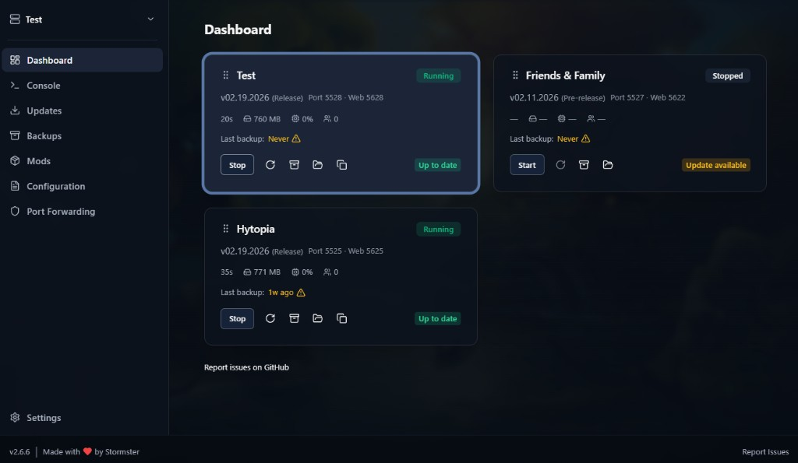

# Hytale Server Manager

A modern desktop application for managing your Hytale dedicated servers.

 

*Make sure you have Java 25+ from the Requirements section below. Support the project and get access to future experimental addons on [Patreon](https://www.patreon.com/c/stormster).*

## Features

- **Dashboard** – Overview of all server instances with status, quick start/stop, backup, and drag-and-drop reordering
- **Console** – Live-streaming console output, server start/stop controls, and command suggestions with sub-command panel
- **Updates** – Check for server updates, switch between release and pre-release channels, install with live progress
- **Backups** – Create, restore, rename, and delete backups. Supports both server snapshots (full instance) and Hytale world snapshots (`--backup` / `/backup`).
- **Mods** – View installed mods, upload .jar files (drag & drop), enable/disable mods, check Nitrado plugin updates, install required Nitrado mods, open mods folder
- **Configuration** – Edit config.json, whitelist.json, bans.json, and world configs via form editors or raw JSON
- **Port Forwarding** – Check Windows Firewall status per port, add firewall rules, UPnP discovery, local/public IP with show-hide for privacy, copy connection info for players
- **Multiple Instances** – Create, add, and import multiple servers; switch between them in one app
- **Settings** – Hytale auth management, servers root folder, instance rename, Java status checks

## Requirements

- **Windows**
- **Java 25+** (Temurin recommended): https://adoptium.net/temurin/releases
- **Hytale account** – Used for authentication and server downloads

## Support

Report issues on [GitHub Issues](https://github.com/Stormster/hytale-server-manager/issues).
